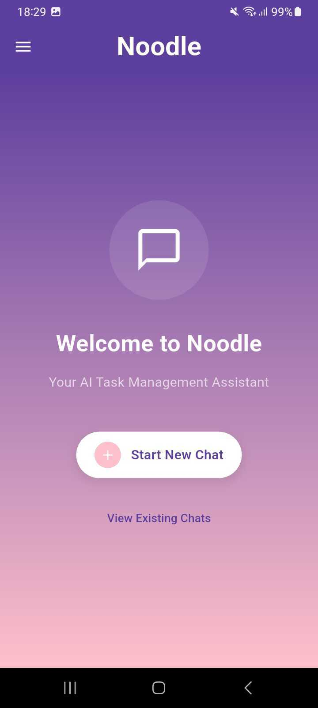

# 🍜 Noodle

**Noodle** is an offline AI application that provides ChatGPT-like responses using Google's Gemma 3n model. Chat with AI without internet connectivity, with support for both text conversations and image input analysis - all responses are in text format.

## ✨ Features

- **🤖 Offline AI Chat**: Full ChatGPT-like experience without internet dependency
- **🖼️ Image + Text Input**: Send messages with images for AI analysis, get text responses
- **⚡ Dual Processing**: Optimized for both GPU and CPU inference
- **🔒 Privacy-First**: All processing happens locally on your device
- **📱 Cross-Platform**: Built with Flutter for mobile and desktop compatibility
- **💾 Local Model**: Uses Google's Gemma 3n E2B model for reliable performance

## 🚀 Getting Started

### Prerequisites

- Flutter SDK (latest stable version)
- Android Studio / Xcode (for mobile development)
- Sufficient storage space for the AI model (~3GB)

### Installation

1. **Clone the repository**

   ```bash
   git clone <your-repo-url>
   cd noodle
   ```

2. **Install dependencies**

   ```bash
   flutter pub get
   ```

3. **Download the AI Model**

   The app uses Google's Gemma 3n E2B model. Download it from:
   [https://huggingface.co/google/gemma-3n-E2B-it-litert-preview](https://huggingface.co/google/gemma-3n-E2B-it-litert-preview)

   **Note**: You'll need to accept Google's usage license on Hugging Face to access the model files.

4. **Place the model in the correct directory**

   - Copy the downloaded model files to app
   - Ensure the model path is correctly configured in your app

5. **Run the application**
   ```bash
   flutter run
   ```

## 🎯 How It Works

1. **Text Chat**: Type your message and get AI responses powered by Gemma 3n
2. **Image Analysis**: Upload or capture an image, add a text prompt, and get AI insights in text format
3. **Offline Processing**: All AI processing happens locally using the downloaded model
4. **Dual Mode**: Automatically switches between GPU (faster) and CPU (compatible) processing

## 🔧 Technical Details

### Model Information

- **Model**: Google Gemma 3n E2B (Instruction-Tuned)
- **Architecture**: LiteRT (Lightweight Runtime) optimized for edge devices
- **Input Support**: Text and images (256x256, 512x512, or 768x768 resolution)
- **Output**: Text responses only
- **Context Length**: Up to 32K tokens
- **Model Size**: ~3GB (quantized)

### Performance

- **GPU Mode**: Faster inference with hardware acceleration
- **CPU Mode**: Compatible with all devices using XNNPACK optimization
- **Memory**: Efficient parameter activation for low-resource devices

## 📱 Screenshots

<p align="left">
  
  
  
  
  
</p>

## 🛠️ Development

### Project Structure

```
noodle/
├── lib/
│   ├── models/          # AI model integration
│   ├── screens/         # UI screens
│   ├── services/        # Business logic
│   └── utils/           # Helper functions
├── assets/
│   └── models/          # AI model files
└── pubspec.yaml         # Dependencies
```

### Key Dependencies

- `flutter` - UI framework
- `google_mlkit_text_recognition` - Text extraction from images
- `image_picker` - Image selection and capture
- `path_provider` - File system access
- `shared_preferences` - Local data storage

## 🤝 Contributing

1. Fork the repository
2. Create a feature branch (`git checkout -b feature/amazing-feature`)
3. Commit your changes (`git commit -m 'Add amazing feature'`)
4. Push to the branch (`git push origin feature/amazing-feature`)
5. Open a Pull Request

## 📄 License

This project is licensed under the MIT License - see the [LICENSE](LICENSE) file for details.

## 🙏 Acknowledgments

- **Google DeepMind** for the [Gemma 3n model](https://huggingface.co/google/gemma-3n-E2B-it-litert-preview)
- **Hugging Face** for hosting the model repository
- **Flutter team** for the amazing cross-platform framework

## 📞 Support

If you encounter any issues or have questions:

- Open an issue on GitHub
- Check the troubleshooting section below
- Review the model documentation on Hugging Face

## 🔍 Troubleshooting

### Common Issues

**Model not loading:**

- Ensure the model files are in the correct directory
- Check file permissions
- Verify the model path in configuration

**Slow performance:**

- Enable GPU mode if available
- Close other resource-intensive applications
- Check available device memory

**Image processing errors:**

- Ensure images are in supported formats (JPEG, PNG)
- Check image resolution limits
- Verify camera/gallery permissions
